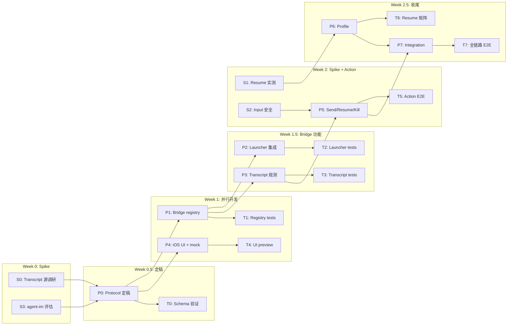

# MMSChat 执行计划 — 深度审查 + 细化任务

> 基于对 1232 行执行计划 + bridge.js（2496 行）+ terminal-hub.js（538 行）+ agent-im session-registry/store 的完整审计。

---

## 🔍 计划质量评估

### ✅ 做得好的

| 维度 | 评价 |
|---|---|
| **问题定义** | 清晰。明确了 Terminal ≠ Chat 的产品边界 |
| **Source of truth** | 正确。"Claude native session 是唯一记忆真相" 避免了双数据库陷阱 |
| **删除语义** | 三级删除（Hide / Clear cache / Destroy）很成熟 |
| **安全边界** | 不存 token/secrets 明文，符合 AGENTS.md |
| **MVP 分阶段** | Read-only → Send behind flag → Parser → Profile，节奏合理 |
| **agent-im 参考** | 正确识别了可复用的 session-registry 概念 |

### 🟡 需要修正 / 有坑的

---

## ⚠️ 问题 1：Transcript 来源是最大的技术赌注

计划中 P3 写的是 "从 tmux capture/control stream 获取 raw transcript → 做轻量清洗"。但这**是整个项目成败的关键路径**，当前只给了一个 S 任务（S0），没有足够的 fallback 设计。

**真实困难**：

```
Claude Code CLI 的输出不是简单的 user/assistant 交替。
它包含：
- ANSI 颜色/格式控制
- Tool use 的 spinner / progress bar
- Permission prompts（带 y/n 交互）
- Markdown 渲染的 box drawing 字符
- Context window usage bars
- Multi-line code blocks with syntax highlighting
```

从 tmux capture-pane 拿到的是**渲染后的终端画面**，不是结构化的 message timeline。要从这里面"清洗"出 user/assistant block，等于在做一个**终端输出→对话结构的逆向解析器**。

> [!CAUTION]
> **这不是 "轻量清洗" — 这是一个 hard parsing problem。** 如果 S0 的结论是 "只能靠 tmux capture"，那 P3 的工作量会从 "1-2 天" 膨胀到 "1-2 周"，并且长期维护成本极高（Claude CLI 每次改版 UI 都可能 break parser）。

**建议**：

1. **S0 必须在 P1 之前完成**，不能并行。S0 的结论直接决定 P3 的实现策略。
2. 优先调查 Claude Code 是否有 `--output-format json` 或 `JSONL` 模式（类似 `claude --json`）。
3. 调查 `~/.claude/` 下是否有 native session transcript 文件（类似 `.claude/projects/<hash>/conversations/`）。
4. 如果两者都不可用，P3 MVP 应该**放弃结构化解析**，直接展示 raw terminal output（类似当前 Terminal 的 snapshot view），而不是假装能分出 user/assistant。

---

## ⚠️ 问题 2：mmschat/send 的输入路径没有定义清楚

计划说 "send text into controlled Claude input path"，但没有定义 "controlled Claude input path" 是什么。

**实际选项**：

| 路径 | 实现 | 风险 |
|---|---|---|
| A. `tmux send-keys` | 直接往 pane 发字符 | Mac 同时在用时会冲突；Claude 正在 tool use 时发送会打断 |
| B. 自研 PTY owner | bridge 持有 PTY fd | 需要重构 terminal 创建逻辑；与 tmux 的 PTY 所有权冲突 |
| C. Claude CLI stdin pipe | spawn 时保留 stdin | 需要修改 MMS 的启动方式；不兼容现有 tmux attach 模式 |

**S2 说了这个问题但没给出足够细的 spike 产物要求。**

**建议**：S2 的验收条件应该是：
1. 明确选定 A/B/C（MVP 推荐 A）
2. 写出 `tmux send-keys` 的具体发送协议（换行处理、escape 处理）
3. 定义 "busy 检测" 的策略（通过 tmux capture 最后一行检查 prompt 存在）
4. 定义冲突提示的文案（"Claude 正在运行中，等待完成后再发送"）

---

## ⚠️ 问题 3：Session 注册时机模糊

P2 说 "MMS 启动 Claude 时自动登记 MMSChat session"。但**谁来触发这个登记？**

当前 MMS 的 Claude 启动有几种路径：
1. 用户在 Mac Terminal 手动 `mms claude ...`
2. bridge CLI 的 `mms-remote mmschat create`（计划中新增）
3. 通过现有 terminal/create RPC 创建带 `command: "claude ..."` 的 pane

**问题**：路径 1 是最常用的，但 bridge 根本不知道用户手动输了什么命令。bridge 只知道 "tmux 有一个新 pane，里面跑了个进程"。

**建议**：
- 路径 1 需要一个**发现机制**：定期扫描 tmux pane 列表，检查 `currentCommand` 是否包含 `claude` / `codex`
- 或者走 agent-im 的 hook 路径：在 MMS 的 claude wrapper 脚本里加 IPC 通知
- P2 必须明确选定哪种方式，否则 "自动登记" 就变成空话

---

## ⚠️ 问题 4：nativeClaudeSessionId 获取是未解问题

计划的 4.3 节列了 `nativeClaudeSessionId` 作为关键字段，但获取方式只说了 "从 stdout/stderr/tmux title/known pattern 抓取"。

**实际难度**：
- Claude Code 的 session ID 在启动时打印在哪里？格式是什么？
- 如果用 `--resume` 启动，session ID 的输出位置可能不同
- tmux title 是否包含 session ID 取决于 Claude CLI 的 `setTitle` 行为

**建议**：这应该是 S0 的核心产物之一，不能推迟到 P2 再想办法。

---

## ⚠️ 问题 5：bridge.js 路由模式需要提前规划

看了 bridge.js 的 `handleApplicationMessage`（L536-L588），当前是一个大 if-else chain。MMSChat 需要在这里加一个新分支：

```javascript
if (handleMMSChatRequest(rawMessage, sendApplicationResponse, mmschatHub)) {
  return;
}
```

**潜在冲突**：P7（Integration）才做这个注册，但 P1-P5 都需要一个能工作的 RPC 入口来测试。

**建议**：P0 的产物应该包括一个 minimal `handleMMSChatRequest` routing stub，让 P1-P5 可以独立工作。

---

## ⚠️ 问题 6：Worktree 拆分有隐含依赖

计划说 Worktree A（Bridge）和 Worktree B（iOS UI）可以并行。但：

- Worktree B 需要 `MMSChatModels.swift` 的数据模型
- 数据模型来自 P0（由 Worktree C Integration owner 负责）
- 所以 **B 不能在 P0 完成前真正并行**

**建议**：P0 必须先输出 JSON schema + Swift model，然后 A 和 B 才能真正并行。

---

## 📋 细化后的任务矩阵

### S 任务（Spike / 调研，不产出代码，只产出结论文档）

| ID | 名称 | 产物 | 工作量 | 前置 | 阻塞 |
|---|---|---|---|---|---|
| **S0** | Claude transcript 源研究 | `.ai/plan/progress/mmschat-s0-transcript-source.md` | 0.5 天 | 无 | P3 |
| **S1** | Provider/model resume 实测 | `.ai/plan/progress/mmschat-s1-resume-matrix.md` | 0.5 天 | 有 Claude CLI | P6 |
| **S2** | Live input 安全策略 | `.ai/plan/progress/mmschat-s2-input-safety.md` | 0.5 天 | S0 | P5 |
| **S3** | agent-im 迁移评估 | `.ai/plan/progress/mmschat-s3-agent-im-reuse.md` | 0.5 天 | 无 | P1 |

#### S0 详细任务清单

```
S0-1. 检查 Claude Code CLI 是否支持 --output-format json 或类似结构化输出
S0-2. 检查 ~/.claude/ 目录结构，寻找 native session transcript 文件
S0-3. 检查 claude --resume <id> 的 session ID 来源和获取方式
S0-4. 用 tmux capture-pane -p 抓取一个真实 Claude 会话输出，评估可解析性
S0-5. 给出 transcript 来源优先级排序（native file > json stream > tmux capture）
S0-6. 给出 nativeClaudeSessionId 的最可靠获取方式
```

#### S2 详细任务清单

```
S2-1. 用 tmux send-keys 往正在运行 Claude 的 pane 发送消息，记录行为
S2-2. 测试 Claude 正在 tool use / waiting permission 时 send-keys 的效果
S2-3. 设计 "busy 检测" 策略（capture 最后 N 行检查 prompt pattern）
S2-4. 设计冲突提示文案（中英双语）
S2-5. 选定 MVP 策略（推荐 A: send-keys + busy guard）
```

---

### P 任务（开发任务）

| ID | 名称 | 工作量 | 前置 | Worktree |
|---|---|---|---|---|
| **P0** | Protocol + Model 定稿 | 1 天 | S0, S3 | C (Integration) |
| **P1** | Bridge registry + store | 1.5 天 | P0 | A (Bridge) |
| **P2** | Claude launcher 集成 | 1 天 | P1 | A (Bridge) |
| **P3** | Transcript 观测 | 1.5-5 天* | P1, S0 | A (Bridge) |
| **P4** | iOS MMSChat list/detail UI | 2 天 | P0 | B (iOS) |
| **P5** | Action integration (send/resume/open/kill) | 2 天 | P3, S2 | A+B (合并) |
| **P6** | Provider/model profile | 1 天 | S1 | A (Bridge) |
| **P7** | Integration + release polish | 1.5 天 | P1-P6 | C (Integration) |

> *P3 工作量取决于 S0 结论：如果有 native transcript → 1.5 天；如果只有 tmux capture → 3-5 天

#### P0 详细子任务

```
P0-1. 冻结 MMSChatSession JSON schema（基于 S0 结论调整 transcript 字段）
P0-2. 冻结 RPC method names + params + response shapes
P0-3. 生成 MMSChatModels.swift（给 Worktree B 用）
P0-4. 生成 mmschat-protocol.js routing stub（给 Worktree A 用）
P0-5. 定义 error codes（session_not_found / pane_dead / busy / resume_failed）
P0-6. 冻结删除语义的 RPC 行为（hide vs kill vs destroy）
```

#### P1 详细子任务

```
P1-1. 创建 mmschat-store.js（参考 agent-im store.ts 的 atomic write + fallback）
P1-2. 创建 mmschat-registry.js（register / update / list / hide / clear-cache）
P1-3. 实现 status transitions（running → idle → dead → needs-resume）
P1-4. 实现 lastActivity / preview 自动更新
P1-5. 确保 corrupt store 能 graceful fallback
P1-6. 确保 session index 不被 reset-pairing 清掉
```

#### P2 详细子任务

```
P2-1. 选定 session 发现机制（hook 通知 vs tmux pane 扫描）
P2-2. 实现 "Claude session 自动注册" 逻辑
P2-3. 从进程启动信息提取 provider/model/cwd/nativeSessionId
P2-4. 处理 "初期拿不到 nativeSessionId" 的 pending 状态
P2-5. 确保不影响现有 terminal/create 功能
```

#### P4 详细子任务

```
P4-1. 创建 MMSChatModels.swift（从 P0 产物复制）
P4-2. 创建 CodexService+MMSChat.swift（RPC 调用层，先用 mock）
P4-3. 创建 MMSChatListView.swift（session 列表，按 project/cwd 分组）
P4-4. 创建 MMSChatDetailView.swift（transcript 详情，monospace text）
P4-5. 实现空态 / 错误态 / 加载态
P4-6. 本地化 key 添加（zh-Hans + en）
P4-7. 用 mock data 做 SwiftUI Preview 验证
```

---

### T 任务（测试任务）

| ID | 名称 | 类型 | 对应 P | 工作量 |
|---|---|---|---|---|
| **T0** | P0 JSON schema 冻结验证 | Manual | P0 | 0.25 天 |
| **T1** | Registry CRUD + corrupt fallback | Node test | P1 | 0.5 天 |
| **T2** | Launcher 登记 + session 发现 | Node test + Manual | P2 | 0.5 天 |
| **T3** | Transcript 清洗准确度 | Node test + Fixture | P3 | 0.5 天 |
| **T4** | iOS mock data 渲染 | SwiftUI Preview / 手工 | P4 | 0.5 天 |
| **T5** | Send/Kill/Resume 端到端 | Manual smoke test | P5 | 0.5 天 |
| **T6** | Provider resume 兼容矩阵 | Manual | P6 | 0.25 天 |
| **T7** | 全链路 MVP 走通 | Manual E2E | P7 | 0.5 天 |

#### T1 详细用例

```
T1-1. register session → list → verify entry exists
T1-2. update session status (running → idle → dead → needs-resume)
T1-3. hide session → list (includeHidden=false) → verify hidden
T1-4. clear transcript cache → verify cache file removed, index preserved
T1-5. corrupt sessions.json → load → verify graceful fallback
T1-6. concurrent register → verify no data loss
T1-7. 50+ sessions → list performance < 50ms
```

#### T5 详细用例

```
T5-1. send text to live Claude → verify output appears in transcript
T5-2. send text while Claude is busy → verify "busy" response returned
T5-3. kill live process → verify tmux pane killed, native session preserved
T5-4. open on Mac → verify terminal app opens and attaches to correct pane
T5-5. resume dead session → verify new process starts with saved profile
T5-6. resume → send → verify input enters resumed session
```

#### T7 E2E 验证脚本

```
1. Mac: npm start (bridge)
2. Mac: mms claude --model kimi ... (启动 Claude 会话)
3. iPhone: 打开 MMSChat tab → 看到新 session
4. iPhone: 点进详情 → 看到最近输出
5. iPhone: Open on Mac → Mac terminal 打开对应 pane
6. iPhone: Kill → 确认进程停止、session 变 needs-resume
7. iPhone: Resume → 确认进程恢复
8. 关闭 bridge → 重启 → 验证 session 索引持久化
```

---

## 📈 执行顺序（关键路径图）



---

## 🚫 不应该做的（做减法）

| 容易犯的错 | 为什么不做 |
|---|---|
| 在 MMSChat 详情页加 terminal 操作按钮 | 产品边界混乱 |
| 给 MMSChat 加独立的 tab | 当前只有 3 个 Tab，加第 4 个会拥挤；建议先放在 Terminal Tab 的 segment control 里 |
| 双数据库同步 | 计划已经正确否决了这个 |
| 支持非 Claude agent 的 transcript 解析 | MVP 只做 Claude，别的 agent 输出格式完全不同 |
| 实现 Markdown 渲染 | Phase 3 的事，MVP 用 monospace text 即可 |
| 自动刷新 transcript（polling < 1s） | 太贵。MVP 用手动 pull-to-refresh + 5s polling |

---

## 🏗 UI 入口决策建议

计划 S14 第 7 点留了 open question："UI 入口放在独立 tab、Codex sidebar 分组，还是 Terminal/Settings 中？"

**建议**：放在 Terminal Tab 内部，用 Segmented Control 切换 `Terminal | Sessions`。

理由：
1. 不增加新 Tab（当前 3 Tab 已经是移动端合理上限）
2. Sessions 和 Terminal 的用户场景高度重叠（都是看 Mac 上跑的东西）
3. 如果未来 Sessions 成为主要入口，可以反转顺序变成 `Sessions | Terminal`
4. 实现上只需在 `terminalAppBody` 里加一个 state 切换，不碰 ContentView 的 Tab 结构

---

## 总结

| 维度 | 评估 |
|---|---|
| **计划完整度** | 🟢 90% — 框架完整，问题定义清晰 |
| **关键遗漏** | 🔴 S0 是整个项目的 gatekeeper，必须先做 |
| **工作量估算** | 🟡 P3 被低估，取决于 S0 结论可能 3x |
| **并行可行性** | 🟡 P0 必须先完成，之后 A/B 才能真正并行 |
| **可执行性** | 🟢 按上面修正后的关键路径执行，MVP 约 5-7 工作日可达 |

**推荐立即行动**：先跑 S0 + S3（各 0.5 天），用结论修正 P0 的 protocol，然后开始并行。
