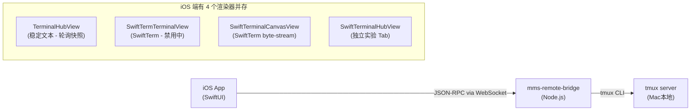

# Terminal 架构深度审查：方向评估 + 迭代建议

## 📊 现状一览

### 当前系统组成



| 文件 | 行数 | 角色 |
|---|---|---|
| [TerminalHubView.swift](file:///Users/xin/auto-skills/CtriXin-repo/mms-remote/CodexMobile/CodexMobile/Views/Terminal/TerminalHubView.swift) | 1134 | 主 Terminal Tab — 轮询快照 + 文本渲染 |
| [SwiftTermTerminalView.swift](file:///Users/xin/auto-skills/CtriXin-repo/mms-remote/CodexMobile/CodexMobile/Views/Terminal/SwiftTermTerminalView.swift) | 219 | SwiftTerm 桥 — **被 `false &&` 硬禁用** |
| [SwiftTerminalCanvasView.swift](file:///Users/xin/auto-skills/CtriXin-repo/mms-remote/CodexMobile/CodexMobile/Views/Terminal/SwiftTerminalCanvasView.swift) | 386 | SwiftTerm byte-stream 渲染 |
| [SwiftTerminalHubView.swift](file:///Users/xin/auto-skills/CtriXin-repo/mms-remote/CodexMobile/CodexMobile/Views/Terminal/SwiftTerminalHubView.swift) | 468 | 独立的 SwiftTerm 实验 Tab |
| [TerminalModels.swift](file:///Users/xin/auto-skills/CtriXin-repo/mms-remote/CodexMobile/CodexMobile/Models/TerminalModels.swift) | 715 | 数据模型 — 超级防御性解析 |
| [CodexService+Terminal.swift](file:///Users/xin/auto-skills/CtriXin-repo/mms-remote/CodexMobile/CodexMobile/Services/CodexService+Terminal.swift) | 467 | RPC 调用层 |

---

## 🔴 URGENT: 必须立即改变的策略

### 1. 双渲染路径必须二选一 — 现在就选

> [!CAUTION]
> 当前存在 **两套完全不同的终端渲染策略** 并存，这是所有 bug 的根源。

**路径 A — 轮询快照**（当前 `TerminalHubView` 主路径）:
- 每秒 `terminal/snapshot` 轮询 → 文本替换到 `Text()` 或 `SwiftTermTerminalView`
- SwiftTerm 渲染器被 `false && useExperimentalSwiftTermRenderer` 硬禁用
- 实际效果：纯文本渲染、无颜色、无交互性、1 秒延迟

**路径 B — 实时 byte-stream**（`SwiftTerminalHubView` 实验 Tab）:
- `terminal/stream/start` → tmux control-mode → base64 chunks → `SwiftTerminalCanvasView`
- 完整 ANSI/颜色支持，但作为独立 Tab 存在，与主流程割裂

**诊断**：你一直在两条路之间犹豫，导致：
- 主路径（轮询）体验差，但稳定
- 实验路径（streaming）体验好，但隔离在一个实验 Tab、无法替代主路径
- 两套代码各自维护 pane 选择、resize、input 逻辑 — 重复了 ~800 行代码

> [!IMPORTANT]
> **建议：立即决定走 streaming 路径（路径 B），废弃轮询快照作为主渲染方式**。轮询快照降级为 fallback（断连后只读查看）。

### 2. `TerminalModels.swift` 的防御性解析已失控

715 行模型文件里，**超过 400 行是用来猜测 JSON 字段名的**：
- `terminalPaneString` / `terminalPaneInt` 每个字段尝试 5-8 个 key 变体
- `terminalStringDeep` 递归 5 层 JSON 搜索
- `terminalFieldArray` 尝试 `fields`、`values`、`row`、数字索引 4 种格式
- `repairTerminalPanes` 做 cross-reference 修复

> [!WARNING]
> 这说明 **bridge 端的数据协议不稳定，iOS 端在做消费者不该做的事**。解析层越防御，协议漂移越不可见，形成恶性循环。

**建议**：
1. 在 bridge 的 `decoratePane()` 锁死输出 schema（已经做了 `fields` + 标准 key，但需要文档化）
2. iOS 端 `ManagedTerminalPane(json:)` 砍掉深度搜索和猜测逻辑，只走标准 key
3. 加一个 schema version 字段（`v: 1`），不匹配时报错而不是猜测

### 3. Pane 寻址混乱是最大的"各种问题"来源

一个 pane 有 **6 种 ID**：`id`、`paneId`、`paneKey`、`target`、`requestTarget`、`paneAddress`。

```swift
// CodexService+Terminal.swift 里的匹配逻辑
pane.paneId == selectedTerminalPaneId
    || pane.paneKey == selectedTerminalPaneId
    || pane.target == selectedTerminalPaneId
    || pane.requestTarget == selectedTerminalPaneId
    || pane.paneAddress == selectedTerminalPaneId
```

这意味着每次选择、匹配、存储 snapshot 都要做 5-way 比较。git log 里最近 12 个 commit 中 **10 个是修 pane target 问题**：

```
fix(terminal): harden ios terminal handoff
fix(terminal): resolve fallback panes before lookup
fix(terminal): keep fallback snapshots addressable
fix(terminal): resolve ios fallback pane targets
fix(ios): repair invalid terminal targets
fix(terminal): avoid empty pane targets
fix(terminal): harden pane list startup
fix(ios): recover terminal pane targets
fix(ios): auto select terminal panes
fix(terminal): keep created pane target
```

> [!CAUTION]
> **10/12 的 commit 都在修同一类 bug**，这是一个需要策略改变的信号。

**建议**：统一为 **单一 canonical ID** — tmux 的 `%N` pane ID（如 `%42`）。所有 `paneKey`、`paneAddress`、`target` 降级为纯显示/调试字段。

---

## 🟡 架构方向评估

### 整体方向是对的

核心架构（iOS → WebSocket RPC → Node bridge → tmux）方向没问题。tmux 作为会话管理后端是正确的选择：
- ✅ 持久化 — app 关闭后 session 存活
- ✅ 多 pane — 支持 split、多 window
- ✅ 远程友好 — bridge 可以跑在任何 Mac

### Bridge 端做得不错

- `terminal-hub.js` 层次清晰：hub → adapter → control-adapter
- `terminal-stream-hub.js` 的 stream 生命周期管理（seq、heartbeat、replay buffer）设计合理
- `tmux-control-adapter.js` 的 control-mode 解析正确

### iOS 端问题集中在 View 层

Service 层（`CodexService+Terminal.swift`）干净整洁。问题全在 View 层：
- 代码重复（TerminalHubView 1134 行 vs SwiftTerminalHubView 468 行 做近乎相同的事）
- 状态管理分散（`localSelectedTerminalPaneTarget` vs `codex.selectedTerminalPaneId` 两套选中状态）
- SwiftTerm 集成方式脆弱（`UIViewRepresentable` + 手动 snapshot diff/feed）

---

## 🟢 推荐迭代计划

### Phase 1: 统一 Pane ID（1-2 天）

1. Bridge `decoratePane()` 增加 `canonicalId` 字段（= `paneId` 即 `%N`）
2. iOS 端所有匹配/存储统一用 `canonicalId`
3. 删除 `paneMatches` 5-way 比较，改为 `pane.canonicalId == target`
4. 精简 `TerminalModels.swift` 解析逻辑

### Phase 2: 合并为单一 Streaming Terminal Tab（2-3 天）

1. 将 `SwiftTerminalCanvasView`（byte-stream 渲染）搬入 `TerminalHubView` 作为默认渲染器
2. 将 `SwiftTerminalHubView` 的 stream 生命周期管理（start/stop/reconnect）搬入主 Tab
3. 删除 `SwiftTermTerminalView`（被 `false &&` 禁用的那个，已无意义）
4. 轮询快照降级为 **disconnected fallback**：断连后 read-only 查看
5. 删除 `SwiftTerminalHubView` 实验 Tab

### Phase 3: 精简 View 状态（1 天）

1. 所有 terminal 选中状态统一用 `codex.selectedTerminalPaneId`，删除 `localSelectedTerminalPaneTarget`
2. 将 `TerminalHubView` 的 1134 行拆成：
   - `TerminalPaneStripView` — pane 切换
   - `TerminalControlBarView` — 输入 + 快捷键
   - `TerminalHubView` — 组装 + 生命周期

### Phase 4: 协议文档化（0.5 天）

1. 在 `Docs/` 下添加 `terminal-protocol.md`
2. 固化 bridge → iOS 的 pane schema
3. 加 `protocolVersion` 字段，双端验证

---

## 总结

| 维度 | 评估 |
|---|---|
| 整体架构方向 | ✅ 正确（iOS → RPC → bridge → tmux） |
| Bridge 端 | ✅ 质量好，层次清晰 |
| iOS Service 层 | ✅ 干净，API 设计合理 |
| iOS View 层 | ❌ 双路径并存 + 重复代码 + 状态分裂 |
| 数据协议 | 🟡 bridge 端有 schema 但 iOS 端过度防御 |
| Pane ID 体系 | ❌ 6 种 ID 导致持续 bug |
| **最紧急的改变** | **统一 pane ID + 合并渲染路径** |
