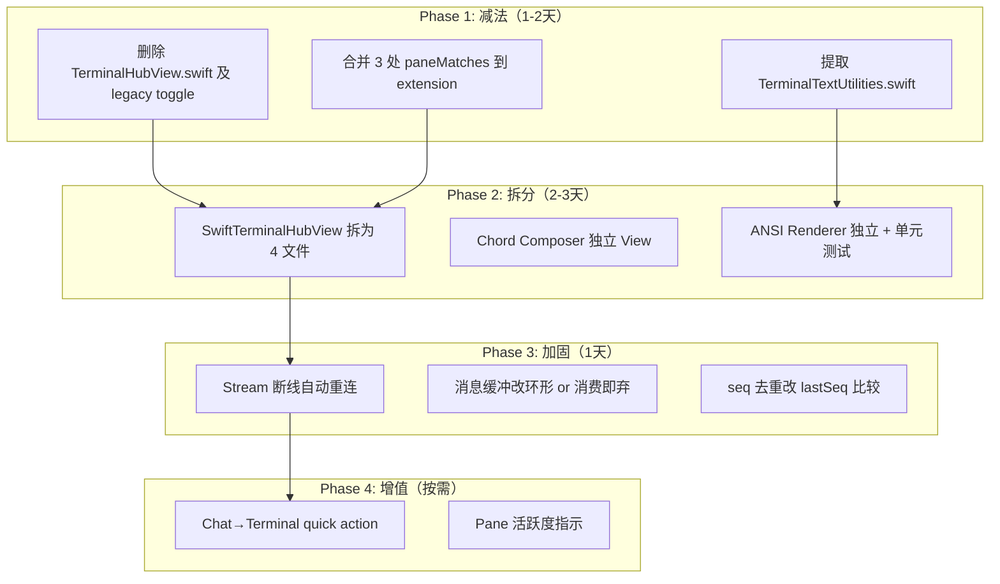

# Terminal 健康检查 + 未来迭代规划

> 基于 2832 行 SwiftTerminalHubView + 1249 行 TerminalHubView + 478 行 CanvasView + 504 行 Service + 714 行 Models 的完整审计。

---

## 🔴 高危问题（需要注意）

### 1. Stream Message 内存增长风控

```swift
// CodexService+Terminal.swift:332
if messages.count > 1_500 {
    messages.removeFirst(messages.count - 1_500)
}
```

当前限制为 1500 条消息/stream。每条 `TerminalStreamMessage` 携带 base64 输出数据。对于高输出场景（`tail -f`、CI 日志、agent 长对话）：
- **1500 条 × 平均 2KB base64 ≈ 3MB** 常驻内存，已经可以接受
- 但 `removeFirst(count)` 对 Array 是 **O(n) copy** — 在高频输出下可能造成 UI 卡顿

> [!WARNING]
> **风险等级：中**。当前 1500 上限本身合理，但建议改用环形缓冲或直接 `removeSubrange(0..<overflow)` 减少 copy 开销。长期应将消息"消费即丢弃"，而非全部存在 array 里等 SwiftUI diff。

### 2. 双端 paneMatches 仍做 5-way 比较

```swift
// SwiftTerminalHubView.swift:1729
func paneMatches(_ pane: ManagedTerminalPane, target: String?) -> Bool {
    return pane.requestTarget == target
        || pane.paneId == target
        || pane.paneKey == target
        || pane.paneAddress == target
        || pane.target == target
}
```

同样的逻辑在 3 个地方重复：
- `SwiftTerminalHubView.paneMatches` (L1729)
- `SwiftTerminalCloseRequest.matches` (L2262)  
- `CodexService+Terminal.paneMatches` (L445)

> [!WARNING]
> **风险等级：中-低**。功能正确，但这是上次审查 "10/12 commit 修同一类 bug" 的根源。尚未引起新 crash，但每次 bridge 数据格式变化都可能再次触发。

### 3. `handleTerminalStreamEvent` 无去重保护

```swift
// CodexService+Terminal.swift:330
if !messages.contains(where: { $0.seq == message.seq }) {
    messages.append(message)
```

`contains` 在 1500 条 array 上是 **O(n)** 线性扫描。在高频输出下每秒 ~20-50 次调用，总计 ~30K-75K 次比较/秒。

> [!WARNING]
> **风险等级：低-中**。实际上 seq 基本递增不会重复。建议改为 `lastSeq` 比较代替全量扫描。

### 4. 无高危 crash 级问题

以下已确认**无问题**：
- ✅ `startStream()` 有 `streamLifecycleToken` 防 race
- ✅ `stopActiveStream` 清理 streamId 前先清 task
- ✅ `scenePhase` 切换正确处理 background/active
- ✅ `onChange(of: codex.isConnected)` 正确断连清理
- ✅ `shouldSuppressInput` 防双击/重复发送
- ✅ `MMSStreamTerminalView.feedPreservingScroll` 滚动稳定
- ✅ Tab 切换时 `stopAllTerminalStreams()` 释放资源

---

## 📊 代码量概览

| 文件 | 行数 | 状态 |
|---|---|---|
| SwiftTerminalHubView.swift | **2831** | 🟡 过大，需要拆分 |
| TerminalHubView.swift | 1249 | 🔴 已降级为 legacy，应计划移除 |
| SwiftTerminalCanvasView.swift | 478 | ✅ 健康 |
| CodexService+Terminal.swift | 503 | ✅ 健康 |
| TerminalModels.swift | 714 | 🟡 防御过度但稳定 |
| **Total** | **5775** | — |

---

## 🔧 拆与合：未来迭代规划

### ❌ 应该拆的

#### 1. SwiftTerminalHubView.swift → 4 个文件

当前 2831 行包含了 **View + 11 个 private 类型 + ANSI 解析器 + StableTextView**。建议：

| 拆出文件 | 行数预估 | 职责 |
|---|---|---|
| `SwiftTerminalHubView.swift` | ~600 | 主 View body + lifecycle |
| `SwiftTerminalKeyBar.swift` | ~250 | keyBar + chord composer + shortcuts |
| `SwiftTerminalANSIRenderer.swift` | ~300 | ANSI escape 解析 + SGR → AttributedString + xterm256 颜色 |
| `SwiftTerminalTypes.swift` | ~500 | Theme/RendererMode/ShortcutProfile/ChordModifier/ChordKey/Shortcut/ButtonStyle/CloseRequest |

**拆分理由**：ANSI 解析器(`applySGRParameters`/`extendedANSIColor`/`xterm256Color`/`ansiTerminalColor`) 是纯函数，与 View 状态无关，完全可以独立测试和复用。

#### 2. Chord Composer → 独立 View

`chordComposerPanel` 及相关 modifier/key/gesture 代码 (~220 行) 是一个自包含功能，可以成为 `SwiftTerminalChordComposerView`。

### ✅ 应该合的

#### 1. paneMatches → 单一入口

3 个 `paneMatches` 实现应合并为 `ManagedTerminalPane` 的 extension：

```swift
extension ManagedTerminalPane {
    func matches(target: String?) -> Bool {
        guard let target else { return false }
        return requestTarget == target || paneId == target
            || paneKey == target || paneAddress == target || self.target == target
    }
}
```

#### 2. Terminal sanitization 函数 → 共享 Utility

`sanitizeTerminalDisplayText` / `isTerminalControlScalar` / `isUnsupportedTerminalDisplayScalar` / `trimTerminalBlankEdges` 在 TerminalHubView 和 SwiftTerminalHubView 中完全重复。应提取到 `TerminalTextUtilities.swift`。

#### 3. Stable snapshot 轮询逻辑

`TerminalHubView` 和 `SwiftTerminalHubView` 各自维护一套 stable snapshot 轮询。如果 legacy 保留，至少共享轮询逻辑。

### 🗑 应该删的（做减法）

#### 1. TerminalHubView.swift — 降级后删除

`useLegacyTerminalInterface` 默认 `false`，只在 Settings 中有一个 toggle。SwiftTerminalHubView 已经包含了完整的 stable + swiftTerm 双模式渲染器。

**建议**：下一个大版本发布后删除 `TerminalHubView.swift`（1249 行），同时删除 Settings 中的 legacy toggle。

#### 2. SwiftTermTerminalView.swift — 可能可以删

219 行。需要确认是否还有其他入口在使用它。从 grep 看只被 `SwiftTerminalCanvasView` 间接引用（通过 `TerminalView`）。如果 `SwiftTerminalCanvasView` 是唯一 SwiftTerm 入口，则 `SwiftTermTerminalView.swift` 可以删除。

#### 3. TerminalHubView 的 `isSwiftTermRendererActive` 残留

Legacy view 里 `isSwiftTermRendererActive` 永远 `false`（硬编码），但代码中仍有 ~15 处 if/else 分支保护这个 dead path。

### 🚫 不应该加的功能

以下是常见的"看起来有用但应该做减法"的功能：

| 功能 | 为什么不加 |
|---|---|
| 多 Tab 终端（像 iTerm2） | 当前 pane 切换 Menu 已经够用；多 Tab 增加大量复杂度 |
| 终端录屏/回放 | 与核心 agentic 场景无关，增加内存压力 |
| 终端内搜索 | `SwiftTerm` 不原生支持，需要自己实现 buffer 搜索；ROI 低 |
| SSH 直连 | 偏离项目本质（远程操控本地 Mac），增加安全面 |

### ✅ 值得加的功能（高 ROI）

| 功能 | 优先级 | 理由 |
|---|---|---|
| **Quick Action：在当前 cwd 执行命令** | P0 | 从 Chat Tab 的 turn 里一键跳到 Terminal Tab 并在对应 pane 执行，闭环 agentic 体验 |
| **Stream 断线自动重连** | P0 | 当前 stream 断了只靠手动 refresh，应自动恢复 |
| **Pane 活跃度指示器** | P1 | 在 pane 选择 Menu 里显示哪个 pane 有输出、哪个空闲 |
| **Agent pane 智能选中** | P1 | `paneDefaultScore` 已有基础，可以更积极地自动跳转到 agent 正在运行的 pane |

---

## 📋 迭代优先级排序



---

## 总结

| 维度 | 评估 |
|---|---|
| **Crash 级高危** | ✅ 无。核心生命周期管理正确 |
| **性能隐患** | 🟡 消息去重 O(n) + removeFirst O(n)，在高输出场景可能卡顿 |
| **代码债** | 🟡 SwiftTerminalHubView 2831 行需拆分；TerminalHubView 1249 行应删除 |
| **重复代码** | 🔴 ~200 行 sanitization + paneMatches 在多处重复 |
| **架构稳定性** | ✅ 双渲染器（stable/swiftTerm）策略正确，legacy 退化路径干净 |
| **建议迭代顺序** | 先做减法（删 legacy）→ 再拆大文件 → 最后加固性能 |
